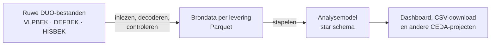

<a id="readme-top"></a>

[![Python][python-shield]][python-url]
[![Licentie: MIT][license-shield]][license-url]
[![Issues][issues-shield]][issues-url]
[![Stars][stars-shield]][stars-url]
[![Code style: ruff][ruff-shield]][ruff-url]

<br />
<div align="center">
  <h1 align="center">ho-bekostiging-bestanden</h1>

  <p align="center">
    Leest DUO HO-bekostigingsbestanden in en zet ze om naar schone, onderzoeksklare data.
    <br />
    <a href="https://cedanl.github.io/ho-bekostiging-bestanden/"><strong>Lees de documentatie »</strong></a>
    <br />
    <br />
    <a href="#demo">Demo</a>
    &middot;
    <a href="https://github.com/cedanl/ho-bekostiging-bestanden/issues/new">Bug melden</a>
    &middot;
    <a href="https://github.com/cedanl/ho-bekostiging-bestanden/issues/new">Functie voorstellen</a>
  </p>
</div>

<details>
  <summary>Inhoudsopgave</summary>
  <ol>
    <li>
      <a href="#over-dit-project">Over dit project</a>
      <ul>
        <li><a href="#demo">Demo</a></li>
        <li><a href="#gebouwd-met">Gebouwd met</a></li>
      </ul>
    </li>
    <li>
      <a href="#aan-de-slag">Aan de slag</a>
      <ul>
        <li><a href="#vereisten">Vereisten</a></li>
        <li><a href="#installatie">Installatie</a></li>
      </ul>
    </li>
    <li>
      <a href="#gebruik">Gebruik</a>
      <ul>
        <li><a href="#stap-1--bestanden-verwerken">Stap 1 — Bestanden verwerken</a></li>
        <li><a href="#stap-2--dashboard">Stap 2 — Dashboard</a></li>
        <li><a href="#stap-3--resultaten">Stap 3 — Resultaten</a></li>
        <li><a href="#eigen-data-verwerken">Eigen data verwerken</a></li>
        <li><a href="#commandoregel-cli">Commandoregel (CLI)</a></li>
      </ul>
    </li>
    <li><a href="#data-en-datamodel">Data en datamodel</a></li>
    <li><a href="#roadmap">Roadmap</a></li>
    <li><a href="#bijdragen">Bijdragen</a></li>
    <li><a href="#licentie">Licentie</a></li>
    <li><a href="#contact">Contact</a></li>
    <li><a href="#dankwoord">Dankwoord</a></li>
  </ol>
</details>

## Over dit project

Hogescholen en universiteiten kunnen bij DUO een analysebestand opvragen: voorlopig
(VLPBEK), definitief (DEFBEK) en historisch (HISBEK). Daarin staat per inschrijving
en per graad of die bekostigd wordt, en zo niet, waarom niet. De bestanden zijn ruw:
`|`-gescheiden, meerdere recordsoorten door elkaar en geen kopregel. Je kunt er zo
niets mee in Excel, R of Python.

Deze repo leest ze in, decodeert de velden en controleert de kwaliteit. Dat levert
twee producten op:

- **Brondata per levering** (`data/02-prepared/`): elk DUO-bestand als Parquet per
  recordsoort, getrouw aan de levering en alleen getypeerd.
- **Analysemodel** (`data/03-output/…/datamodel/`): een star schema (dimensies +
  feiten) waarin de leveringen zijn samengevoegd.



Waarom dit nuttig is:

- **Direct bruikbaar:** schone tabellen in plaats van pipe-gescheiden tekst.
- **Betrouwbaar:** elke levering wordt gecontroleerd, met een kwaliteitsrapport per run.

Dit is de HO-tegenhanger van
[mbo-bekostiging-bestanden](https://github.com/cedanl/mbo-bekostiging-bestanden).
Doelgroep: analisten en onderzoekers bij HO-instellingen die met bekostigingsdata werken.

### Demo

Zie in ruim een minuut hoe de app werkt, met synthetische demo-data:

https://github.com/user-attachments/assets/9e2d128d-70da-4689-acc9-d22efbaf1c94

### Gebouwd met

- [![Python][python-badge]][python-url]
- [![Polars][polars-badge]][polars-url]
- [![Streamlit][streamlit-badge]][streamlit-url]
- [![uv][uv-badge]][uv-url]
- [![pytest][pytest-badge]][pytest-url]
- [![ruff][ruff-badge]][ruff-url]

<p align="right">(<a href="#readme-top">terug naar boven</a>)</p>

## Aan de slag

Zo draai je de app lokaal. De repo bevat synthetische demo-data, dus je hebt geen
eigen bestanden nodig om het uit te proberen.

### Vereisten

- [uv](https://docs.astral.sh/uv/getting-started/installation/), die ook Python 3.13
  voor je regelt.
- Git, om de repo te klonen.

### Installatie

1. Kloon de repo
   ```bash
   git clone https://github.com/cedanl/ho-bekostiging-bestanden.git
   cd ho-bekostiging-bestanden
   ```
2. Installeer de afhankelijkheden
   ```bash
   uv sync
   ```
3. Start de app
   ```bash
   uv run streamlit run app/main.py
   ```

Open daarna het adres dat Streamlit toont (standaard `http://localhost:8501`).

Alles over de bestanden, het datamodel en de kwaliteitscontroles staat in de
[documentatie](https://cedanl.github.io/ho-bekostiging-bestanden/) (bron: [`docs/`](docs/index.md)).

<p align="right">(<a href="#readme-top">terug naar boven</a>)</p>

## Gebruik

### Stap 1 — Bestanden verwerken

Open de app, bekijk de gevonden bestanden en klik **Verwerk alles**. Je kunt ook een
los bestand toevoegen. Per bestand zie je de uitkomst van de controles (bijvoorbeeld
of de tellingen in het sluitrecord kloppen). Het analysemodel wordt daarna uit alle
verwerkte bestanden samen gebouwd.


### Stap 2 — Dashboard

Vijf tabs: bekostigingstrechter, waarom niet bekostigd, aandeel bekostigd per
opleiding, voorlopig tegenover definitief en historie (alleen met HISBEK). Elke grafiek
heeft een toelichting.


### Stap 3 — Resultaten

Kies een tabel uit het star schema, bekijk de eerste 1 000 rijen en download de hele
tabel als CSV.


> **Alleen lokaal gebruiken:** de app is bedoeld als lokale analysetool. Er is geen
> login of rechtenbeheer: wie de app draait, kan alle tabellen downloaden.

### Eigen data verwerken

Zet je bestanden in een eigen map (bijvoorbeeld `data/01-raw/eigen/`; alles buiten
`demo/` wordt door git genegeerd) en wijs de app ernaar met een eigen `config.toml`:

```bash
# bash / macOS / Linux
HO_APP_CONFIG=pad/naar/config.toml uv run streamlit run app/main.py
```

```powershell
# Windows PowerShell
$env:HO_APP_CONFIG = "pad\naar\config.toml"; uv run streamlit run app/main.py
```

Relatieve paden in `config.toml` gaan uit van de repo-map, dus de app werkt ook
als je hem vanuit een andere map start. Welke bestanden je hebt, maakt niet uit: het
werkt met elke combinatie van VLPBEK, DEFBEK en HISBEK, ook zonder HISBEK.

### Commandoregel (CLI)

```bash
# Verwerk één ruw bestand naar prepared
uv run ho verwerk data/01-raw/demo/VLPBEK_2025_20240115_99XX.csv \
    data/02-prepared/demo/VLPBEK_2025_20240115_99XX

# Bouw het star schema vanuit een of meer prepared-mappen
uv run ho star data/02-prepared/demo/* --output data/03-output/demo
```

In Windows PowerShell werkt `*` niet als argument; geef de mappen dan zo mee:

```powershell
uv run ho star (Get-ChildItem data/02-prepared/demo -Directory).FullName --output data/03-output/demo
```

#### Kwaliteit en exitcodes

Elke controle levert een melding met een ernst: `error` of `warning`. Eén
error zet de status op `fail`. De uitvoer wordt altijd geschreven, zodat je
de oorzaak kunt nalezen: per levering in de tabel `VALIDATIE`, en voor het
geheel in `<output>/quality.json`. Dat bestand bevat de status, alle
meldingen per levering en voor het star schema, de sha256 van elk
bronbestand, het aantal rijen per levering × recordsoort en de pakketversie
(schema: `src/ho_bekostiging_bestanden/metadata/quality.schema.json`).

| Exitcode | Betekenis |
|---|---|
| 0 | Klaar; status `ok` of `warn` |
| 1 | Invoerfout (onbekend bestand, geen VLP) |
| 3 | Kwaliteitsstatus `fail` |

Met `--allow-quality-errors` (bij `verwerk` en `star`) geeft een `fail`
exitcode 0 en een regel "Let op: kwaliteitsstatus fail". De app toont de
status op Home en als banner op Dashboard en Resultaten.

<p align="right">(<a href="#readme-top">terug naar boven</a>)</p>

## Data en datamodel

- **Input**: ruwe bestanden in `data/01-raw/`: `VLPBEK_*`, `DEFBEK_*` en `HISBEK_*`.
- **Prepared**: Parquet per recordsoort in `data/02-prepared/`, één submap per levering.
- **Output**: star-schema-tabellen in `data/03-output/…/datamodel/` (zie hieronder).
- Echte data staat niet in git; alleen synthetische demo-data in `data/01-raw/demo/`.

| Tabel | Eén rij per |
|---|---|
| `dim_levering` | verwerkt bestand (met `Sha256` van het bronbestand) |
| `dim_persoon` | student (`_persoon_id` = BSN, anders onderwijsnummer) |
| `dim_instelling` | BRIN (`EigenInstelling` = ontvanger van het bestand) |
| `dim_opleiding` | opleidingscode |
| `dim_status` | bekostigingsstatuscode (34 uit de PvE) |
| `fact_deelname` | inschrijving × levering (BRD + HRD) |
| `fact_resultaat` | graad × levering (BRR + HRR) |
| `fact_status` | statuscode × deelname of resultaat |
| `fact_loopbaan` | student × levering (BLB) |

<p align="right">(<a href="#readme-top">terug naar boven</a>)</p>

## Roadmap

- [x] VLPBEK, DEFBEK en HISBEK inlezen, decoderen en valideren
- [x] Star schema met 9 tabellen
- [x] Dashboard en resultatenpagina in Npuls-huisstijl
- [x] Kwaliteitsbewaking met `quality.json` en exitcodes
- [ ] Overige HO-bestanden: OBO, verschillenlijst, registratieoverzicht, landelijk overzicht
- [ ] Wisselstroom en rendement uit HISBEK (zie `cedanl/wisselstroom`)
- [ ] Opleidings- en instellingsnamen via RIO (`cedanl/rio-onderwijsdata`)
- [ ] Een gedeelde MBO/HO-kernbibliotheek

### Nog te bevestigen

Een aantal inhoudelijke keuzes zijn aannames. Ze staan gemarkeerd als **[Te checken]**
in de ontwerp-spec, onder andere:

- de groepsindeling van de statuscodes (eigen indeling, niet van DUO);
- `mv` als afbakening van "beoordeeld" in de trechter;
- of de oude BLB-versie (`_OUD`, tot 2019) nog voorkomt.

Zie de [open issues](https://github.com/cedanl/ho-bekostiging-bestanden/issues) voor
alle voorgestelde functies en bekende problemen.

<p align="right">(<a href="#readme-top">terug naar boven</a>)</p>

## Bijdragen

Bijdragen maken open source mooi, en alles wat je bijdraagt wordt zeer gewaardeerd.
Heb je een idee? Open een issue, of maak een pull request:

1. Fork het project
2. Maak een feature-branch (`git checkout -b feat/mijn-verbetering`)
3. Draai de checks (zie hieronder) en commit je wijzigingen
4. Push de branch en open een pull request

Nieuwe features gaan via spec (`docs/superpowers/specs/`) → plan
(`docs/superpowers/plans/`) → tests eerst. Technische context voor
(LLM-)bijdragers staat in [`CLAUDE.md`](CLAUDE.md).

```bash
uv run pytest            # tests
uv run ruff check .      # lint
uv run ty check          # types
uv run python scripts/genereer_demo.py   # demo-data opnieuw maken
```

Open de repo in de devcontainer (VS Code / GitHub Codespaces) voor een kant-en-klare
omgeving.

Pas je een grafiek aan in `app/pages/dashboard.py`? Werk dan ook de toelichting in
`app/_chart_docs.py` bij.

<details>
<summary>Huisstijl</summary>

De app gebruikt de Npuls-huisstijl uit de skill `vormgever-npuls-huisstijl` in
[cedanl/.github](https://github.com/cedanl/.github). De design tokens staan in
`app/huisstijl/design-tokens.json`; kleuren, grafiekpalet en CSS komen uit
`app/_huisstijl.py`, en het Streamlit-thema in `.streamlit/config.toml` wordt in de
tests tegen de tokens gecontroleerd.

</details>

<p align="right">(<a href="#readme-top">terug naar boven</a>)</p>

## Licentie

Verspreid onder de MIT-licentie. Zie [`LICENSE`](LICENSE) voor meer informatie.

## Contact

Onderhouden door [CEDA](https://github.com/cedanl) (cedanl).
Projectlink: https://github.com/cedanl/ho-bekostiging-bestanden

## Dankwoord

- Bron: Programma van Eisen HO-instelling – DUO, versie 26.3.1 (17-07-2026), bijlage 8
  (analysebestand) en bijlage 10 (historische bekostiging).
- [mbo-bekostiging-bestanden](https://github.com/cedanl/mbo-bekostiging-bestanden),
  waar deze repo het voorbeeld van volgt.
- [CEDA-standaarden](https://github.com/cedanl/.github/tree/main/standards/README.md)
  en de Npuls-huisstijl.
- [Best-README-Template](https://github.com/othneildrew/Best-README-Template), als
  inspiratie voor de opzet van deze README.

<p align="right">(<a href="#readme-top">terug naar boven</a>)</p>

<!-- MARKDOWN LINKS & BADGES -->
[python-shield]: https://img.shields.io/badge/python-3.13-3776AB?style=for-the-badge&logo=python&logoColor=white
[python-url]: https://www.python.org/
[license-shield]: https://img.shields.io/github/license/cedanl/ho-bekostiging-bestanden?style=for-the-badge
[license-url]: https://github.com/cedanl/ho-bekostiging-bestanden/blob/main/LICENSE
[issues-shield]: https://img.shields.io/github/issues/cedanl/ho-bekostiging-bestanden?style=for-the-badge
[issues-url]: https://github.com/cedanl/ho-bekostiging-bestanden/issues
[stars-shield]: https://img.shields.io/github/stars/cedanl/ho-bekostiging-bestanden?style=for-the-badge
[stars-url]: https://github.com/cedanl/ho-bekostiging-bestanden/stargazers
[ruff-shield]: https://img.shields.io/badge/code%20style-ruff-261230?style=for-the-badge&logo=ruff&logoColor=D7FF64
[ruff-url]: https://docs.astral.sh/ruff/
[python-badge]: https://img.shields.io/badge/Python-3776AB?style=for-the-badge&logo=python&logoColor=white
[polars-badge]: https://img.shields.io/badge/Polars-CD792C?style=for-the-badge&logo=polars&logoColor=white
[polars-url]: https://pola.rs/
[streamlit-badge]: https://img.shields.io/badge/Streamlit-FF4B4B?style=for-the-badge&logo=streamlit&logoColor=white
[streamlit-url]: https://streamlit.io/
[uv-badge]: https://img.shields.io/badge/uv-DE5FE9?style=for-the-badge&logo=uv&logoColor=white
[uv-url]: https://docs.astral.sh/uv/
[pytest-badge]: https://img.shields.io/badge/pytest-0A9EDC?style=for-the-badge&logo=pytest&logoColor=white
[pytest-url]: https://pytest.org/
[ruff-badge]: https://img.shields.io/badge/ruff-261230?style=for-the-badge&logo=ruff&logoColor=D7FF64
