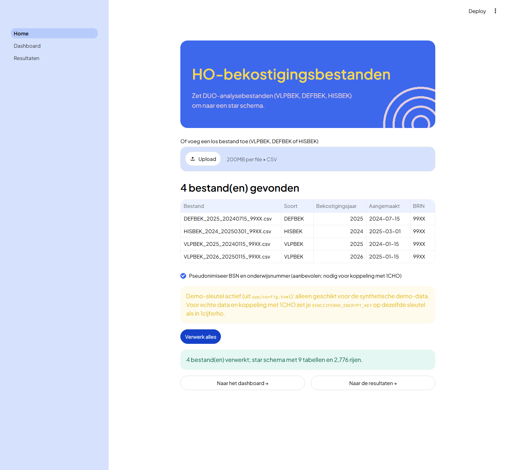
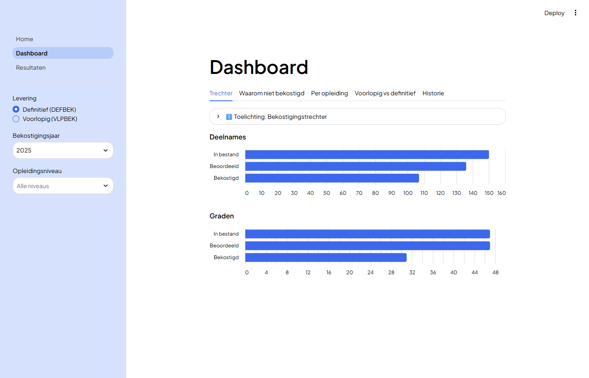
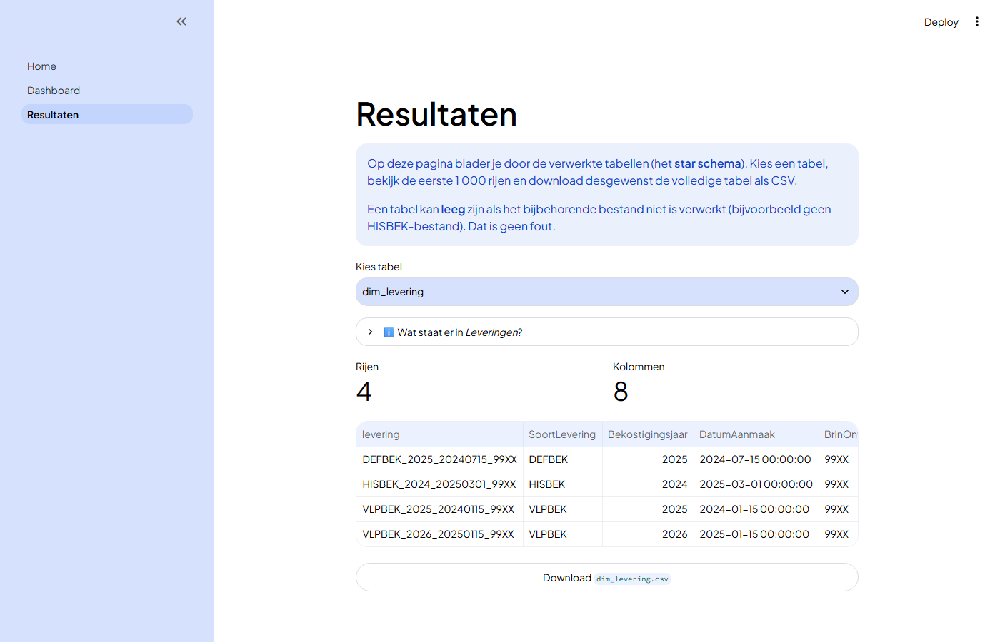

# Aan de slag

Deze pagina laat zien hoe je de tool installeert, de app gebruikt, je eigen bestanden
verwerkt en de opdrachtregel en Python-API aanroept. De repo bevat synthetische demo-data,
dus je kunt alles uitproberen zonder eigen bestanden.

## Installatie

Je hebt [uv](https://docs.astral.sh/uv/getting-started/installation/) nodig; die regelt
ook Python 3.13.

```bash
git clone https://github.com/cedanl/ho-bekostiging-bestanden.git
cd ho-bekostiging-bestanden
uv sync
```

Liever een kant-en-klare omgeving? Open de repo in de devcontainer (VS Code of GitHub
Codespaces).

## De app gebruiken

```bash
uv run streamlit run app/main.py
```

Open het adres dat Streamlit toont (standaard `http://localhost:8501`). De app heeft drie
pagina's.

### Stap 1 — Bestanden verwerken (Home)

De app toont de gevonden bestanden met soort, bekostigingsjaar, aanmaakdatum en BRIN.
Klik **Verwerk alles**. Je kunt ook een los bestand toevoegen met de uploadknop. Per bestand
zie je de uitkomst van de controles. Daarna bouwt de app het analysemodel uit alle
verwerkte bestanden samen. Zie [Kwaliteit](kwaliteit.md) voor wat de statussen betekenen.



### Stap 2 — Dashboard

Vijf tabs met grafieken en een toelichting per grafiek. Zie [Dashboard](dashboard.md).



### Stap 3 — Resultaten

Kies een tabel uit het star schema, bekijk de eerste 1 000 rijen en download de volledige
tabel als CSV. Boven elke tabel staat een uitleg in gewone taal. Een tabel kan leeg zijn als
het bijbehorende bestand niet is verwerkt (bijvoorbeeld geen HISBEK); dat is geen fout.



!!! note "Alleen lokaal gebruiken"
    De app is een lokale analysetool. Er is geen login of rechtenbeheer: wie de app draait,
    kan alle tabellen bekijken en downloaden.

## Eigen data verwerken

1. Zet je DUO-bestanden in een eigen map, bijvoorbeeld `data/01-raw/eigen/`. Alles buiten
   `data/01-raw/demo/` wordt door git genegeerd.
2. Maak een kopie van `app/config.toml` en wijs de paden naar je eigen mappen:

    ```toml
    [data]
    raw = "data/01-raw/eigen"
    prepared = "data/02-prepared/eigen"
    output = "data/03-output/eigen"
    ```

3. Start de app met de omgevingsvariabele `HO_APP_CONFIG`:

    === "bash / macOS / Linux"

        ```bash
        HO_APP_CONFIG=pad/naar/config.toml uv run streamlit run app/main.py
        ```

    === "Windows PowerShell"

        ```powershell
        $env:HO_APP_CONFIG = "pad\naar\config.toml"; uv run streamlit run app/main.py
        ```

Relatieve paden in `config.toml` gaan uit van de repo-map, dus de app werkt ook als je hem
vanuit een andere map start. Welke bestanden je hebt, maakt niet uit: het werkt met elke
combinatie van VLPBEK, DEFBEK en HISBEK.

!!! note "Sleutel voor persoonsnummers"
    BSN en onderwijsnummer worden bij het verwerken vervangen door een pseudoniem. Voor eigen
    data stel je de omgevingsvariabele `EENCIJFERHO_ENCRYPT_KEY` in (minimaal 64 tekens), of
    geef je een bestand mee met `--sleutelbestand`. Gebruik dezelfde sleutel als in
    [1cijferho](https://github.com/cedanl/1cijferho), dan kun je beide koppelen.

### De bestandsnaam

De tool herkent een bestand aan de naam: `TTTTTT_JJJJ_EEJJMMDD_99XX.csv`.

| Deel | Betekenis | Voorbeeld |
|---|---|---|
| `TTTTTT` | Soort levering: `VLPBEK`, `DEFBEK` of `HISBEK` | `DEFBEK` |
| `JJJJ` | Bekostigingsjaar (bij HISBEK het laatste bekostigingsjaar) | `2025` |
| `EEJJMMDD` | Aanmaakdatum | `20240715` |
| `99XX` | BRIN van de ontvanger | `99XX` |

Hoofd- en kleine letters maken niet uit, en een spatie na de eerste underscore (zoals het
PvE die noteert) wordt getolereerd. Een bestand dat hier niet aan voldoet, bijvoorbeeld
`… (1).csv` na een dubbele download, wordt overgeslagen; de app meldt dat.

## Opdrachtregel (CLI)

```bash
# Verwerk één ruw bestand naar prepared
uv run ho verwerk data/01-raw/demo/DEFBEK_2025_20240715_99XX.csv \
    data/02-prepared/demo/DEFBEK_2025_20240715_99XX

# Bouw het star schema vanuit een of meer prepared-mappen
uv run ho star data/02-prepared/demo/* --output data/03-output/demo
```

In Windows PowerShell werkt `*` niet als argument; geef de mappen dan zo mee:

```powershell
uv run ho star (Get-ChildItem data/02-prepared/demo -Directory).FullName --output data/03-output/demo
```

| Optie | Bij | Betekenis |
|---|---|---|
| `--fmt parquet\|csv` | `verwerk` | Uitvoerformaat (standaard Parquet). Het star schema leest alleen Parquet. |
| `--sleutelbestand <pad>` | `verwerk` | Bestand met de sleutel, in plaats van de omgevingsvariabele. |
| `--geen-pseudonimisering` | `verwerk` | Laat BSN en onderwijsnummer leesbaar. |
| `--allow-quality-errors` | `verwerk`, `star` | Exitcode 0 ook bij kwaliteitsstatus `fail`. |
| `--output <map>` | `star` | Doelmap; het star schema komt in `<map>/datamodel/`. |

Exitcodes: `0` klaar, `1` invoerfout, `3` kwaliteitsstatus `fail`. Zie [Kwaliteit](kwaliteit.md).

## Python

```python
from pathlib import Path

from ho_bekostiging_bestanden.pipeline import run_pipeline, run_star, verwerk_alles

# Eén bestand naar prepared
run_pipeline(
    "data/01-raw/demo/DEFBEK_2025_20240715_99XX.csv",
    "data/02-prepared/demo/DEFBEK_2025_20240715_99XX",
)

# Star schema uit prepared-mappen
star = run_star(
    ["data/02-prepared/demo/DEFBEK_2025_20240715_99XX"],
    "data/03-output/demo",
)
star["fact_deelname"]            # Polars DataFrame

# Alles in een map in één keer (zoals "Verwerk alles" in de app)
verwerking = verwerk_alles(
    Path("data/01-raw/demo"), Path("data/02-prepared/demo"), Path("data/03-output/demo")
)
verwerking.status, verwerking.meldingen
```

`run_pipeline` en `run_star` werpen een `KwaliteitsFout` bij status `fail` (de uitvoer staat
dan al op schijf). `verwerk_alles` werpt die niet: het geeft `status` en `meldingen` terug,
zodat de meldingen per bestand niet verloren gaan.

!!! warning "Kwaliteitsoordeel"
    Gebruik `run_star` voor gevalideerde data. Directe aanroepen van `build_star()` of
    `stack_prepared()` (bijvoorbeeld in een notebook) schrijven geen `quality.json` en
    controleren het model niet.

## Veelvoorkomende meldingen

| Melding | Oorzaak | Oplossing |
|---|---|---|
| *Onbekend bestandstype* | De bestandsnaam voldoet niet aan het patroon. | Hernoem naar `TTTTTT_JJJJ_EEJJMMDD_99XX.csv`. |
| *Geen voorlooprecord (VLP)* | Het bestand is leeg of beschadigd. | Vraag het bestand opnieuw op bij DUO. |
| *Geen pseudonimiseringssleutel gevonden* | Er is geen sleutel ingesteld. | Zie het kader *Sleutel voor persoonsnummers*. |
| *Geen Parquet-bestanden in …* | Het bestand is met `--fmt csv` verwerkt. | Verwerk het opnieuw zonder `--fmt csv`. |
| *Leveringslabel(s) komen meer dan eens voor* | Twee prepared-mappen hebben dezelfde naam. | Geef elke map een eigen naam. |
| *Deels wel en deels niet gepseudonimiseerd* | Leveringen zijn met verschillende keuzes verwerkt. | Verwerk ze allemaal met dezelfde keuze. |

## Ontwikkelen

```bash
uv run pytest            # tests
uv run ruff check .      # lint
uv run ruff format .     # opmaak
uv run ty check          # types
uv run python scripts/genereer_demo.py   # demo-data opnieuw maken
```

### Deze documentatie bouwen

```bash
uv sync --group docs
uv run mkdocs serve          # lokaal bekijken op http://127.0.0.1:8000
uv run mkdocs build --strict # zoals in CI; faalt op kapotte links
```

Bij elke push naar `main` bouwt de workflow `docs.yml` de site en publiceert die op GitHub
Pages.
