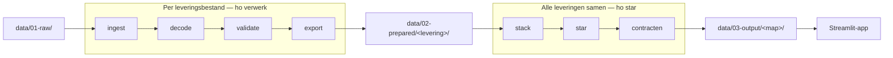

# Architectuur

De tool is een pijplijn van kleine modules. Elke fase doet één ding en geeft Polars-tabellen
door aan de volgende. De Streamlit-app bevat geen bedrijfslogica: die zit in het package.



## Modules

Alle modules staan in `src/ho_bekostiging_bestanden/`.

| Module | Taak |
|---|---|
| `ingest.py` | Leest een multi-record bestand in en splitst per recordsoort. Knipt regels af of vult ze aan tot het schema. `parse_bestandsnaam()` haalt soort, jaar, datum en BRIN uit de naam. |
| `decode.py` | Zet tekst om naar typen via het schema: datums, `J`/`N`, getallen, `-1` naar `null` met `_NVT`-vlag. Normaliseert `CodeBekostigingstatus`. |
| `validate.py` | Controles op één levering: tellingen in SLR, verplichte velden, codelijsten, BRIN en jaar. |
| `export.py` | Schrijft tabellen als Parquet (standaard) of CSV. |
| `pipeline.py` | Orkestratie: `run_pipeline` (één bestand), `run_star` (star schema) en `verwerk_alles` (een hele map). |
| `stack.py` | Stapelt prepared-mappen onder elkaar met een `levering`-kolom. |
| `star.py` | Bouwt het star schema (zie [Datamodel](datamodel.md)). |
| `contracten.py` | Controleert het star schema: uniciteit, lege sleutels en koppelingen. |
| `kwaliteit.py` | Ernst, status, de kwaliteitspoort en het schrijven van `quality.json`. |
| `indicatoren.py` | Pure functies voor het dashboard: trechter, redenen, per opleiding, voorlopig/definitief, historie. |
| `pseudonimisering.py` | Vervangt BSN en onderwijsnummer door een pseudoniem, gelijk aan [1cijferho](https://github.com/cedanl/1cijferho). |
| `demo.py` | Genereert de synthetische demo-bestanden (vaste seed). |
| `cli.py` | De opdrachtregel `ho`. |
| `metadata/` | Veldschema's (TOML) en codelijsten (CSV); zie hieronder. |

## Metadata

Alles wat uit het PvE komt staat als data, niet als code:

| Bestand | Inhoud |
|---|---|
| `analyse_schema.toml` | Velden en typen van VLP, BLB, BRD, BRR en SLR (VLPBEK/DEFBEK) |
| `hisbek_schema.toml` | Velden en typen van VLP, HRD, HRR en SLR (HISBEK) |
| `*.csv` | De [waardenlijsten](waardenlijsten.md), met de bekostigingsstatussen in `bekostigingstatus.csv` |
| `quality.schema.json` | JSON-schema van `quality.json` |

Een schema beschrijft per recordsoort `fields` (de volgorde), `date_fields`, `bool_fields`,
`int_fields`, `float_fields`, `nvt_fields`, `required_fields`, `codelijsten` en `single_row`.
Kolomnamen, typen en codelijsten worden uit het schema gelezen, zodat het star schema en de
controles meebewegen als het schema verandert. Een nieuwe PvE-versie is dus vooral een
wijziging in deze bestanden (zie [PvE-versies](pve-wijzigingen.md)).

## Extra tabellen in de brondata

Naast de recordsoorten schrijft de pijplijn twee tabellen per levering:

| Tabel | Inhoud |
|---|---|
| `LEVERING` | Eén rij met soort, jaar, aanmaakdatum, BRIN van de ontvanger, bestandsnaam, `Sha256`, `SchemaVersie` en `Gepseudonimiseerd` |
| `VALIDATIE` | De meldingen van de controles: `Controle`, `Recordsoort`, `Melding`, `Aantal`, `Ernst` |

`SchemaVersie` (de PvE-versie waarmee is ingelezen) staat alleen in de brondata; het star
schema neemt hem niet over in `dim_levering`.

## Mappenstructuur

```
ho-bekostiging-bestanden/
├── data/
│   ├── 01-raw/demo/          # synthetische demo-bestanden (in git)
│   ├── 02-prepared/          # brondata per levering (gegenereerd, niet in git)
│   └── 03-output/            # star schema + quality.json (gegenereerd, niet in git)
├── docs/                     # deze documentatie
├── scripts/genereer_demo.py  # maakt de demo-bestanden
├── src/ho_bekostiging_bestanden/
├── app/                      # Streamlit-app (geen bedrijfslogica)
└── tests/
```

## Configuratie

| Wat | Waar |
|---|---|
| Paden van de app | `app/config.toml` (eigen versie via `HO_APP_CONFIG`) |
| Soorten levering en schema's | `SCHEMA_PER_LEVERING` in `ingest.py` |
| Ernst per controle | `ERNST_PER_CONTROLE` in `validate.py` |
| Veldindelingen en codelijsten | `metadata/` |
| Themakleuren | `.streamlit/config.toml`, bewaakt tegen `app/huisstijl/design-tokens.json` |

Er staan geen paden, codes of drempelwaarden midden in de code: ze komen uit configuratie,
constanten bovenaan een module of de metadata.

## Tests en CI

`pytest` draait op de demo-data en op bewust beschadigde bestanden. Een aparte test
vergelijkt de veldvolgorde van HRD en HRR met een uitgeschreven lijst uit het PvE, los van
het schema, zodat een fout in het schema niet stil slaagt. De CI (GitHub Actions) draait
`ruff check`, `ruff format --check`, `ty check` en `pytest` (op Linux en Windows).
