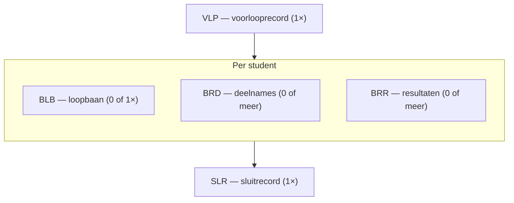

# Analysebestand (VLPBEK en DEFBEK)

Bron: PvE HO-instelling – DUO v26.3.1, bijlage 8 (§17).

## Doel en gebruik

Het bestand geeft gedetailleerd inzicht in **welke deelnames en resultaten worden bekostigd**
en, indien niet, **waarom niet**. Het is bedoeld voor analysedoeleinden. De instelling
ontvangt een eigen bestand; de BRIN in de bestandsnaam is de ontvanger.

## Bestandsnaam

```
VLPBEK_2025_20240115_99XX.CSV
└──┬──┘ └┬─┘ └──┬───┘ └─┬┘
   │     │      │       └─ BRIN van de ontvanger
   │     │      └───────── aanmaakdatum (EEJJMMDD)
   │     └──────────────── bekostigingsjaar
   └────────────────────── VLPBEK (voorlopig) of DEFBEK (definitief)
```

## Opbouw

Het bestand is als volgt opgebouwd:



- Een voorlooprecord ([VLP](../recordtypes/vlp.md)).
- Per student een setje records:
    - nul of één [BLB](../recordtypes/blb.md);
    - nul, één of meer [BRD](../recordtypes/brd.md): alle bekostigingsresultaten van de
      in het bekostigingsjaar beoordeelde deelnames. Daarnaast deelnames die buiten de
      beoordeling vallen; die krijgen de status `mv`. Dat kunnen ook deelnames bij andere
      instellingen zijn;
    - nul, één of meer [BRR](../recordtypes/brr.md): de in het bekostigingsjaar beoordeelde
      resultaten, ook bij andere instellingen;
    - er is voor een student altijd minstens één BRD of BRR.
- Een sluitrecord ([SLR](../recordtypes/slr.md)) met het aantal BLB-, BRD- en BRR-records.

Een student komt in het bestand als hij minstens één bekostigingsresultaat voor een deelname
of resultaat heeft bij de BRIN van de ontvanger. Alle records van dezelfde student hebben
hetzelfde burgerservicenummer en/of onderwijsnummer.

## Sortering

De BLB-records staan oplopend op burgerservicenummer. Heeft een student geen BSN, dan
oplopend op onderwijsnummer, waarbij studenten met alleen een onderwijsnummer achteraan
staan.

## Voorbeeld

```
VLP|99XX|2025|20240715
BLB|700000001|800000001|||||||1|3|3|2|3|2|0|1|3|3|1|3
BRD|700000001|800000001|99XX|99XX000012023|J|pi|HOOG|34001|HBO-BA|B|20230901|20240831|J|S|VT|20230915|12|TECHNIEK|BEKOSTIGD|N|B|N|J|J
```

De student heeft een BLB-record met zijn loopbaan en één deelname (`BRD`) met status `pi`
(*de inschrijving wordt bekostigd*). Bij `BLB` en `BRD` zijn BSN (`700000001`) en
onderwijsnummer (`800000001`) beide gevuld.

## Versies

Tot september 2019 bestonden er twee versies van het analysebestand voorlopige bekostiging,
met een andere BLB. Deze tool ondersteunt alleen de **huidige** versie. Zie
[BLB](../recordtypes/blb.md) en [PvE-versies](../pve-wijzigingen.md#blb-versies).

## Hoe de tool het bestand leest

| Stap | Wat gebeurt er |
|---|---|
| Bestandsnaam | Soort, jaar, aanmaakdatum en BRIN worden uit de naam gehaald. |
| Inlezen | De regels worden per recordsoort gesplitst, afgekapt of aangevuld tot het schema. |
| Decoderen | Datums, `J`/`N`, getallen en `-1` (n.v.t.) krijgen hun type. |
| Controleren | SLR-tellingen, verplichte velden, codelijsten en BRIN/jaar tegen de bestandsnaam. |
| Wegschrijven | Parquet per recordsoort, plus `LEVERING` en `VALIDATIE`. |

Zie [Architectuur](../architectuur.md) en [Kwaliteit](../kwaliteit.md).
