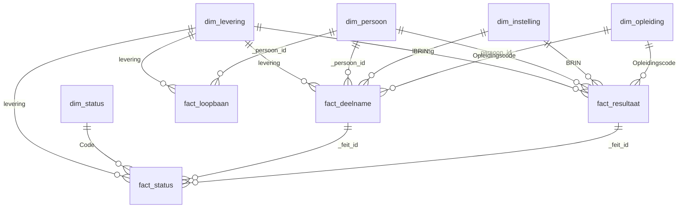

# Datamodel

Het analysemodel is een **star schema** met vijf dimensies en vier feittabellen. Het
staat als Parquet in `data/03-output/<map>/datamodel/` en wordt gebouwd door
`ho star` of **Verwerk alles** in de app. Tabellen waarvoor geen bron is (bijvoorbeeld
geen HISBEK) zijn **leeg maar hebben hun vaste kolommen**, zodat elke query blijft werken.

De kolommen en typen in dit hoofdstuk zijn de uitvoer van de demo-data. Ze volgen de
schema's in `src/ho_bekostiging_bestanden/metadata/`; zie
[Recordtypes](recordtypes/index.md) voor de betekenis van de velden.

## Overzicht

| Tabel | Eén rij per | Sleutel | Bron |
|---|---|---|---|
| [`dim_levering`](#dim_levering) | verwerkt bestand | `levering` | bestandsnaam en VLP |
| [`dim_persoon`](#dim_persoon) | student | `_persoon_id` | BLB, BRD, BRR, HRD, HRR |
| [`dim_instelling`](#dim_instelling) | instelling (BRIN) | `BRIN` | BRD, BRR, HRD, HRR, VLP |
| [`dim_opleiding`](#dim_opleiding) | opleidingscode | `Opleidingscode` | BRD, BRR, HRD, HRR |
| [`dim_status`](#dim_status) | bekostigingsstatuscode | `Code` | codelijst `bekostigingstatus.csv` |
| [`fact_deelname`](#fact_deelname) | deelname × levering | `_feit_id` | BRD + HRD |
| [`fact_resultaat`](#fact_resultaat) | graad × levering | `_feit_id` | BRR + HRR |
| [`fact_status`](#fact_status) | statuscode × deelname of resultaat | `_feit_id` + `Code` | `CodeBekostigingstatus` |
| [`fact_loopbaan`](#fact_loopbaan) | student × levering | `levering` + `_persoon_id` | BLB |

De sleutels zijn **natuurlijke sleutels**; er zijn geen surrogaatsleutels. Dat is bewust
gelijk aan mbo-bekostiging-bestanden.

## Algemene kolommen

| Kolom | Betekenis |
|---|---|
| `levering` | Label van de levering: de bestandsnaam zonder extensie, bijvoorbeeld `DEFBEK_2025_20240715_99XX`. Komt in elke feittabel voor en maakt het mogelijk leveringen naast elkaar te leggen. |
| `_persoon_id` | De persoonssleutel: het BSN, of het onderwijsnummer als er geen BSN is. |
| `_feit_id` | Sleutel van een feitrij in `fact_deelname` en `fact_resultaat`: `D:` of `R:`, de levering en het rijnummer binnen de levering. Hij blijft stabiel als er een levering bijkomt. |
| `<veld>_Ruw` | Alleen in de brondata: de oorspronkelijke tekst van een datum die niet te lezen was. |
| `<veld>_NVT` | `true` als de bron `-1` (*niet van toepassing*) had. Zie [BLB](recordtypes/blb.md). |

## Dimensies

### dim_levering

Eén rij per verwerkt bestand. Hiermee zie je welk bestand precies is verwerkt, en wat
de eigen instelling is (`BrinOntvanger`).

| Kolom | Type | Toelichting |
|---|---|---|
| `levering` | tekst |  |
| `SoortLevering` | tekst | `VLPBEK`, `DEFBEK` of `HISBEK`. |
| `Bekostigingsjaar` | geheel getal | Uit de bestandsnaam; bij HISBEK het laatste jaar in het bestand. |
| `DatumAanmaak` | datum |  |
| `BrinOntvanger` | tekst | BRIN van de instelling die het bestand ontving (uit het VLP). |
| `Bestandsnaam` | tekst |  |
| `Sha256` | tekst | Controlesom van het bronbestand, om te kunnen nagaan welk bestand is verwerkt. |
| `Gepseudonimiseerd` | ja/nee | Of BSN en onderwijsnummer bij het verwerken zijn vervangen door een pseudoniem. |

### dim_persoon

Eén rij per student, over alle leveringen heen. Per veld geldt de eerste niet-lege waarde,
**nieuwste levering eerst**. De graaddatums komen uit het BLB-record.

| Kolom | Type | Toelichting |
|---|---|---|
| `_persoon_id` | tekst | BSN, anders onderwijsnummer. |
| `Burgerservicenummer` | tekst |  |
| `Onderwijsnummer` | tekst |  |
| `DatumGraadBehaaldAD` | datum | Eerste graad per type; zie [BLB](recordtypes/blb.md). |
| `DatumGraadBehaaldADLG` | datum |  |
| `DatumGraadBehaaldBa` | datum |  |
| `DatumGraadBehaaldBaLG` | datum |  |
| `DatumGraadBehaaldMa` | datum |  |
| `DatumGraadBehaaldMaLG` | datum |  |

### dim_instelling

Alle instellingen waar de studenten ingeschreven stonden of een graad behaalden. De
bestanden bevatten ook deelnames en resultaten bij **andere instellingen** van dezelfde
student, dus naast de eigen BRIN staan hier andere BRIN's.

| Kolom | Type | Toelichting |
|---|---|---|
| `BRIN` | tekst |  |
| `EigenInstelling` | ja/nee | `true` voor de BRIN('s) die een bestand ontvingen (`BrinOntvanger`). Het dashboard toont alleen deze instelling. |

### dim_opleiding

Eén rij per opleidingscode, met de kenmerken uit de deelnames en resultaten (nieuwste
levering eerst). Opleidingsnamen zitten niet in de DUO-bestanden.

| Kolom | Type | Toelichting |
|---|---|---|
| `Opleidingscode` | tekst |  |
| `Opleidingsniveau` | tekst |  |
| `OpleidingOnderdeel` | tekst |  |
| `IndicatieSectorLG` | ja/nee |  |
| `IndicatieAcademischZiekenhuis` | ja/nee |  |

### dim_status

De codelijst met bekostigingsstatussen (zie [Waardenlijsten](waardenlijsten.md#bekostigingstatus)),
aangevuld met codes uit de data die niet in het PvE staan. Die krijgen de omschrijving
*Onbekende code (niet in de PvE)*, de groep *Onbekend* en `Bekostigd = false`.

| Kolom | Type | Toelichting |
|---|---|---|
| `Code` | tekst |  |
| `Omschrijving` | tekst |  |
| `Groep` | tekst | Indeling van deze repo, niet van DUO. |
| `Bekostigd` | ja/nee | `true` voor de codes die *wel bekostigd* betekenen. |

## Feiten

### fact_deelname

Eén rij per deelname (inschrijving) per levering: BRD uit VLPBEK/DEFBEK en HRD uit
HISBEK onder elkaar. De persoonsgegevens en de opleidingskenmerken staan in de
dimensies. Velden die alleen in HRD voorkomen zijn `null` voor BRD.

| Kolom | Type | Toelichting |
|---|---|---|
| `_feit_id` | tekst | Sleutel van de feitrij: `D:` of `R:` + levering + rijnummer binnen de levering. |
| `levering` | tekst | Label van de levering (de bestandsnaam zonder extensie). Verwijst naar `dim_levering`. |
| `_persoon_id` | tekst | BSN, anders onderwijsnummer. Verwijst naar `dim_persoon`. |
| `Recordsoort` | tekst | Bron van de rij: `BRD` of `HRD` (deelname), `BRR` of `HRR` (resultaat). |
| `BRIN` | tekst | Verwijst naar `dim_instelling`. |
| `Inschrijvingvolgnummer` | tekst | In HRD niet verplicht, dus mogelijk `null`. |
| `Bekostigingsindicatie` | ja/nee |  |
| `CodeBekostigingstatus` | tekst |  |
| `Bekostigingsniveau` | tekst |  |
| `Opleidingscode` | tekst | Verwijst naar `dim_opleiding`. |
| `Opleidingsfase` | tekst |  |
| `DatumInschrijving` | datum |  |
| `DatumUitschrijving` | datum |  |
| `EersteInschrijving` | ja/nee |  |
| `Inschrijvingsvorm` | tekst |  |
| `Onderwijsvorm` | tekst |  |
| `DatumEersteAanlevering` | datum |  |
| `Bekostigingsduur` | geheel getal |  |
| `Bekostigingscode` | tekst |  |
| `IndicatieBaMa` | tekst |  |
| `IndicatieNationaliteitsvoorwaardeSF` | ja/nee |  |
| `IndicatieGBARelatie` | ja/nee |  |
| `Bekostigingsjaar` | geheel getal | Bij BRD/BRR uit het VLP, bij HRD/HRR uit het record zelf. |
| `ECTS` | decimaal getal | Alleen gevuld in HRD (Open Universiteit); anders `null`. |
| `ECTSBekostigd` | decimaal getal | Alleen gevuld in HRD (Open Universiteit); anders `null`. |
| `DuitseDeelstaat` | tekst | Alleen in HRD/HRR; anders `null`. |
| `IndicatieWoonplaatsVereiste` | ja/nee | Alleen in HRD/HRR; anders `null`. |

### fact_resultaat

Eén rij per graad per levering: BRR en HRR onder elkaar.

| Kolom | Type | Toelichting |
|---|---|---|
| `_feit_id` | tekst | Sleutel van de feitrij: `D:` of `R:` + levering + rijnummer binnen de levering. |
| `levering` | tekst | Label van de levering (de bestandsnaam zonder extensie). Verwijst naar `dim_levering`. |
| `_persoon_id` | tekst | BSN, anders onderwijsnummer. Verwijst naar `dim_persoon`. |
| `Recordsoort` | tekst | Bron van de rij: `BRD` of `HRD` (deelname), `BRR` of `HRR` (resultaat). |
| `BRIN` | tekst | Verwijst naar `dim_instelling`. |
| `Resultaatvolgnummer` | tekst |  |
| `Bekostigingsindicatie` | ja/nee |  |
| `CodeBekostigingstatus` | tekst |  |
| `Bekostigingsniveau` | tekst |  |
| `JointDegreeFactor` | decimaal getal |  |
| `Opleidingscode` | tekst | Verwijst naar `dim_opleiding`. |
| `Opleidingsfase` | tekst |  |
| `EersteGraad` | ja/nee |  |
| `DatumDiploma` | datum |  |
| `Onderwijsvorm` | tekst |  |
| `DatumEersteAanlevering` | datum |  |
| `Bekostigingscode` | tekst |  |
| `IndicatieBaMa` | tekst |  |
| `IndicatieGraadTeltVoorBekostigingsloopbaan` | ja/nee |  |
| `IndicatieNationaliteitsvoorwaardeSF` | ja/nee |  |
| `IndicatieGBARelatie` | ja/nee |  |
| `Bekostigingsjaar` | geheel getal | Bij BRD/BRR uit het VLP, bij HRD/HRR uit het record zelf. |
| `DuitseDeelstaat` | tekst | Alleen in HRD/HRR; anders `null`. |
| `IndicatieWoonplaatsVereiste` | ja/nee | Alleen in HRD/HRR; anders `null`. |

### fact_status

Een brugtabel: een deelname of resultaat kan meerdere statuscodes hebben (`na,ti`). Deze
tabel splitst ze: één rij per code.

| Kolom | Type | Toelichting |
|---|---|---|
| `_feit_id` | tekst | Verwijst naar `fact_deelname` of `fact_resultaat`, afhankelijk van `Bron`. |
| `levering` | tekst |  |
| `Bron` | tekst | `deelname` of `resultaat`. |
| `Code` | tekst | Verwijst naar `dim_status`. |

### fact_loopbaan

Eén rij per student per levering uit het BLB-record: de verbruikstellers en het aantal
bekostigde inschrijvingen. De graaddatums staan in `dim_persoon`. Een teller met `-1`
(*n.v.t.*) is `null`, met een `_NVT`-vlag.

| Kolom | Type | Toelichting |
|---|---|---|
| `levering` | tekst |  |
| `_persoon_id` | tekst |  |
| `VerbruikAD` | geheel getal |  |
| `VerbruikADLG` | geheel getal |  |
| `VerbruikBA` | geheel getal |  |
| `VerbruikBALG` | geheel getal |  |
| `VerbruikMA` | geheel getal |  |
| `VerbruikMALG` | geheel getal |  |
| `AantalBekostigdeInschrijvingenBa` | geheel getal |  |
| `AantalBekostigdeInschrijvingenBaLG` | geheel getal |  |
| `AantalBekostigdeInschrijvingenMa` | geheel getal |  |
| `AantalBekostigdeInschrijvingenMaLG` | geheel getal |  |
| `AantalBekostigdeInschrijvingenBaLGnaGraadBaMa` | geheel getal |  |
| `AantalBekostigdeInschrijvingenMaLGnaGraadMa` | geheel getal |  |
| `VerbruikAD_NVT` | ja/nee |  |
| `VerbruikADLG_NVT` | ja/nee |  |
| `VerbruikBA_NVT` | ja/nee |  |
| `VerbruikBALG_NVT` | ja/nee |  |
| `VerbruikMA_NVT` | ja/nee |  |
| `VerbruikMALG_NVT` | ja/nee |  |
| `AantalBekostigdeInschrijvingenBa_NVT` | ja/nee |  |
| `AantalBekostigdeInschrijvingenBaLG_NVT` | ja/nee |  |
| `AantalBekostigdeInschrijvingenMa_NVT` | ja/nee |  |
| `AantalBekostigdeInschrijvingenMaLG_NVT` | ja/nee |  |
| `AantalBekostigdeInschrijvingenBaLGnaGraadBaMa_NVT` | ja/nee |  |
| `AantalBekostigdeInschrijvingenMaLGnaGraadMa_NVT` | ja/nee |  |

## Relaties en controles

Bij elke bouw controleert de tool het model. Een overtreding is een *error* in
[`quality.json`](kwaliteit.md):

- **Uniciteit:** elke sleutel is uniek in zijn tabel (zie *Sleutel* hierboven).
- **Lege sleutel:** een sleutelkolom bevat geen `null`.
- **Koppeling:** elke niet-lege `levering`, `_persoon_id`, `BRIN`, `Opleidingscode`, `Code`
  en `_feit_id` in een feittabel bestaat in de dimensie waar hij naar verwijst.

Het aantal rijen in `fact_deelname` is gelijk aan het aantal BRD- plus HRD-records, en in
`fact_resultaat` aan het aantal BRR- plus HRR-records.
