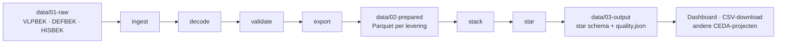

# HO-bekostigingsbestanden

DUO levert aan hogescholen en universiteiten **analysebestanden** waarmee een instelling kan
nagaan welke inschrijvingen en graden bekostigd worden, en zo niet, waarom niet. Deze
bestanden zijn technisch van opzet: meerdere recordsoorten door elkaar, gecodeerde velden en
geen kolomkoppen.

**Deze tool leest die ruwe bestanden in en levert twee producten**: de **brondata per levering**
(getrouw aan het DUO-bestand, als Parquet) en een **analysemodel** (star schema) dat de
leveringen samenvoegt. Beide zijn direct bruikbaar in Excel, Python, R of Power BI. Zie
[Datamodel](datamodel.md) en [Ontwerpkeuzes](ontwerpkeuzes.md).

De tool rekent de bekostiging **niet** opnieuw uit. Hij maakt de inhoud van de DUO-bestanden
toegankelijk, inclusief de redenen waarom iets niet bekostigd wordt.

Dit is de HO-tegenhanger van
[mbo-bekostiging-bestanden](https://github.com/cedanl/mbo-bekostiging-bestanden).

---

## Drie soorten levering

| Bestand | Wat het is | Recordsoorten |
|---|---|---|
| `VLPBEK_*.csv` | Analysebestand **voorlopige** bekostiging | VLP, BLB, BRD, BRR, SLR |
| `DEFBEK_*.csv` | Analysebestand **definitieve** bekostiging | VLP, BLB, BRD, BRR, SLR |
| `HISBEK_*.csv` | **Historische** bekostiging: alle definitieve jaren in het verleden | VLP, HRD, HRR, SLR |

Elke soort levering is **optioneel**: de tool werkt met elke combinatie, ook zonder HISBEK
en met maar één VLPBEK. Zie [Databestanden](databestanden/index.md).

---

## Wat levert de tool op?

| | Brondata per levering | Analysemodel |
|---|---|---|
| Map | `data/02-prepared/<levering>/` | `data/03-output/<map>/datamodel/` |
| Wat | Elk DUO-bestand per recordsoort | Dimensies en feiten over alle leveringen |
| Keuzes | Alleen technisch: typering en notaties | Inhoudelijk: o.a. sleutels, nieuwste levering eerst, afbakening van "beoordeeld" ([Ontwerpkeuzes](ontwerpkeuzes.md)) |
| Gegarandeerd | Kolommen en volgorde volgens het PvE | Grain en relaties per tabel ([Datamodel](datamodel.md)); status in `quality.json` |
| Voor wie | Wie eigen keuzes wil maken of een levering wil controleren | Wie direct wil analyseren met de keuzes van deze tool |

De fasering is `ingest > decode > validate > export > stack > star schema`. De eerste vier
stappen leveren de brondata, de laatste twee het analysemodel. Zie [Architectuur](architectuur.md).



### Stap 1 — Brondata (per leveringsbestand)

Elk ruw bestand wordt omgezet naar één Parquet-bestand per recordsoort, plus twee
extra tabellen:

```
data/02-prepared/demo/DEFBEK_2025_20240715_99XX/
├── VLP.parquet        ← bestandskop (1 rij)
├── BLB.parquet        ← bekostigingsloopbaan per student
├── BRD.parquet        ← bekostigingsresultaat deelname
├── BRR.parquet        ← bekostigingsresultaat resultaat
├── SLR.parquet        ← sluitrecord (tellingen)
├── LEVERING.parquet   ← gegevens uit bestandsnaam en VLP, sha256 van het bronbestand
└── VALIDATIE.parquet  ← meldingen van de controles
```

Datumvelden zijn `Date`, tellers zijn `Int64`, `J`/`N` is `Boolean` en lege velden zijn
`null` (geen lege strings).

### Stap 2 — Analysemodel: star schema

Alle prepared-mappen worden gestapeld tot negen Parquet-bestanden in
`data/03-output/<map>/datamodel/`:

| Bestand | Eén rij per | Inhoud |
|---|---|---|
| `dim_levering` | verwerkt bestand | Soort levering, jaar, aanmaakdatum, ontvanger, sha256 |
| `dim_persoon` | student | Persoonssleutel en datums van behaalde graden |
| `dim_instelling` | BRIN | Instellingen, met `EigenInstelling` voor de ontvanger |
| `dim_opleiding` | opleidingscode | Niveau, onderdeel, LG-sector, academisch ziekenhuis |
| `dim_status` | statuscode | De 34 bekostigingsstatussen met omschrijving en groep |
| `fact_deelname` | deelname × levering | BRD + HRD: inschrijvingen met hun bekostigingsstatus |
| `fact_resultaat` | graad × levering | BRR + HRR: graden met hun bekostigingsstatus |
| `fact_status` | statuscode × deelname of resultaat | Brugtabel: de losse codes uit `CodeBekostigingstatus` |
| `fact_loopbaan` | student × levering | BLB: verbruik en aantal bekostigde inschrijvingen |

Zie [Datamodel](datamodel.md) voor alle kolommen.

Een `levering`-kolom in elke feittabel geeft aan uit welk bronbestand een rij komt
(bijvoorbeeld `DEFBEK_2025_20240715_99XX`). Zo kun je een voorlopige en een definitieve
levering naast elkaar leggen.

---

## Ruwe opbouw

Alle bestanden zijn **multi-record**: elke regel begint met een recordsoort (`VLP`, `BLB`,
`BRD`, …), de velden zijn gescheiden door `|` en er zijn geen kolomkoppen. Alle regels in een
bestand zijn opgevuld tot hetzelfde aantal velden, dus lege velden aan het eind zijn normaal.

```
VLP|99XX|2025|20240715
BLB|700000001|800000001|||||||1|3|3|2|3|2|0|1|3|3|1|3
BRD|700000001|800000001|99XX|99XX000012023|J|pi|HOOG|34001|HBO-BA|B|20230901|20240831|J|S|VT|20230915|12|TECHNIEK|BEKOSTIGD|N|B|N|J|J
SLR|150|164|47
```

Lege velden aan het eind van een regel zijn hier weggelaten.

Lees meer over de inhoud van elk bestand in [Databestanden](databestanden/index.md) of duik
direct in de [Recordtypes](recordtypes/index.md).

---

## Hoe nu verder?

- **Direct proberen:** [Aan de slag](aan-de-slag.md) met de meegeleverde demo-data.
- **Je eigen bestanden verwerken:** [Eigen data](aan-de-slag.md#eigen-data-verwerken).
- **Begrijpen wat de cijfers betekenen:** [Dashboard](dashboard.md) en
  [Waardenlijsten](waardenlijsten.md), met alle statuscodes.
- **Weten of je data klopt:** [Kwaliteit](kwaliteit.md).

---

## Bronnen

- Programma van Eisen HO-instelling – DUO, versie 26.3.1 (17-07-2026): bijlage 8 (§17,
  analysebestand voorlopige en definitieve bekostiging) en bijlage 10 (§19, historische
  bekostiging). Wat er per versie veranderde en hoe je een nieuwe versie verwerkt, staat in
  [PvE-versies](pve-wijzigingen.md).
- Demo-data: synthetisch, gemaakt met `scripts/genereer_demo.py` (vaste seed). Er staat geen
  echte data in git.
